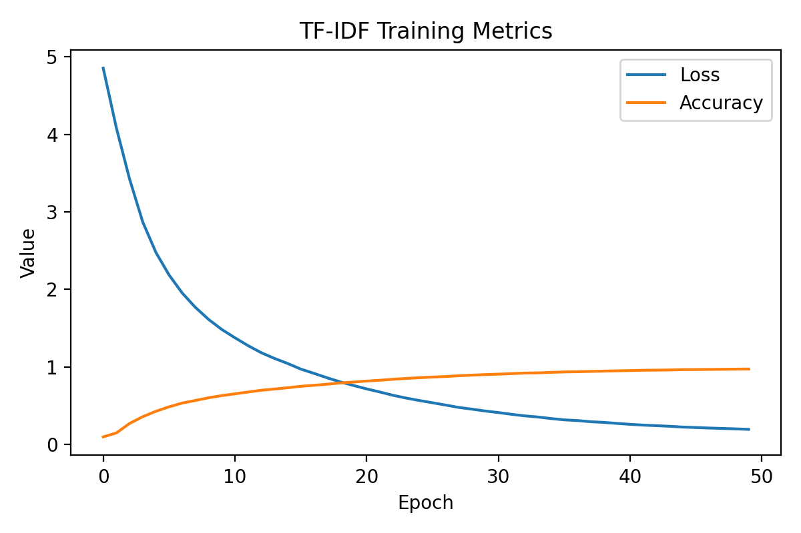
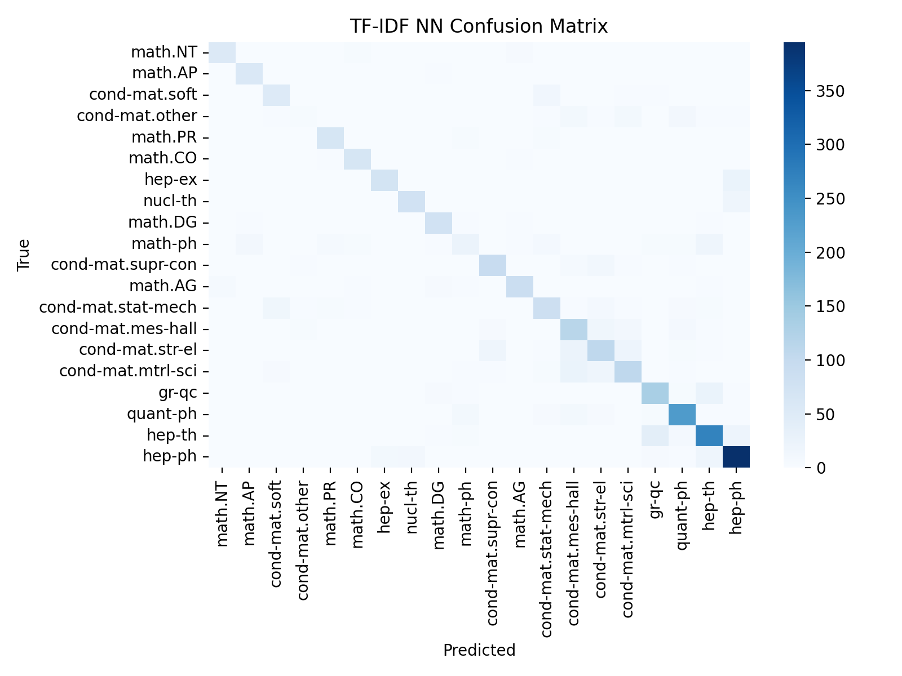

# arxiv-classifier: From-Scratch Neural Network Text Classification Framework
[](LICENSE)
[]()
[]()
[](https://www.kaggle.com/datasets/Cornell-University/arxiv/data)

---
A from-scratch multi-representation text classification framework for scientific papers, based on the arXiv taxonomy, and built with `NumPy` and `PyArrow`.

---

## Table of Contents
- [Overview](#overview)
- [Quick Start](#quick-start)
- [Motivation](#motivation)
- [Contents](#contents)
- [Using the CLI](#using-the-cli)
- [Requirements](#requirements)
- [Performance Insights](#performance-insights)
- [License](#license)
- [Some References](#some-references)

---

## Overview

This repository explores the development of a neural network capable of classifying papers into their thematic categories, using *arXiv* taxonomy, built entirely with `NumPy`, without `TensorFlow` or `PyTorch`, and experiments with different text vectorization methods. The goal is to create an exercise in style, building a complete machine learning pipeline for a classifier, but without resorting to high-level functions that abstract the algorithms behind the work. High-level libraries will always be available out there, but understanding how to reproduce their behavior by hand is knowledge that stays with you.

It also leverages some performance oriented routines on data handling using *Apache Arrow* and *Apache Parquet* (through `PyArrow`), not only because performance matters, but because my machine could not process even a tiny fraction of it, so it has a sort of guerrilla coding note.

The data used in the project comes from the [*Kaggle arXiv dataset*](https://www.kaggle.com/datasets/Cornell-University/arxiv/discussion?sort=hotness). It is a metadata dataset that contains titles, abstracts, categories and such for almost 3 million uploads to the arXiv repository. Due to the size of the data, our pipeline emphasizes performance through *Apache Arrow* (through `PyArrow`) for in memory operations and *Apache Parquet* for storage.

---

# Features

- From-scrath Numpy Feedforward MultiLayer Perceptron implementation.
- Performance oriented preprocessing with PyArrow and Parquet.
- Multiple text vectorizations: TF-IDF, n-grams, embeddings.
- Complete CLI pipeline for reproducibility.
- Reports with confusion matrices and training loss plots.

---

## Quick Start
To begin working with the project, you may first need to install it. This can be done with the following command:

```bash
pip install git+https://github.com/adrianrasoongit/arxiv-classifier.git
```

The project has a CLI controller that allows executing sequentially the stages of the project without having to get your hands dirty. The competences of this controller range from regenerating all the data and metadata of the project, to performing the vectorizations, training the models and generating reports, even all the above together. Later we detail the execution of specific parts of the project; here, we present the command that reproduces the entire project:

```bash
arxiv-classifier all
```

After running the complete project, you should find in `reports/` many infographics around the results of the model, such as, for instance, the graphics below:
| Training | Confusion Matrix |
|----------|------------------|
| |  |

---

## Motivation

The goal of this repository is to develop, without using libraries such as `PyTorch` or `TensorFlow`, a neural model capable of automatically classifying scientific papers according to the thematic categories defined in the *arXiv* repository. This implies taking a more explicit and fundamental approach to how deep learning models are built, reproducing with `NumPy` the mathematical and statistical machinery that underlies the operation of neural networks.

This is interesting for several reasons. First, it is a mathematically fascinating area: from the universal approximation theorem to the manifold hypothesis, neural networks conceal mathematics of deep importance that high-level libraries can easily hide from us unless, at least once, we try to work beneath the hood.


  
*Illustration of the universal approximation theorem in a network.*
<p align = "center"><em> Illustration of the universal approximation theorem in a network.</em></p>

Second, software development, and digital technology in general, has been accumulating layers upon layers of features, frameworks, libraries, and other resources, distancing us from the bare bones of our machines. One does not need to write in assembly to regain that feeling of control over the processes involved in a project; it is enough to pause and revisit what the functions do for us, and occasionally ask ourselves whether we understand them, or even whether we could replicate them.


  
*Diagram of the complete Python stack in many projects.*

Both of these reasons motivate the development of this project, which I consider not only instructive but, above all, enjoyable and satisfying.

---

## The Network

At the moment of writing this README, the project has only one neural network model of the Feedforward MultiLayer Perceptron type (or FMLP, as it is designated in the project), with ReLU and softmax activation, although it is possible that we will implement some additional model in the future, and almost surely tweak some other functions. 

  
*Illustration of a MultiLayer Perceptron. The diagram comes from [this article](https://aiml.com/what-is-a-multilayer-perceptron-mlp/).*

The model presented here is relatively traditional, although it takes advantage of techniques such as the Adam optimizer and He initialization to improve performance, especially considering the limitations we start from: not using PyTorch or TensorFlow forces us to forgo certain optimizations and helper functions that enhance the training and stability of SOTA neural networks.

## Contents
The repository is organized to contain all the stages of a complete ML project, from data acquisition and preprocessing (mainly done with `PyArrow`), to NN implementation and training (done with `NumPy`), and reporting (powered by `sklearn`).
```text
├── data/
│   ├── raw/                # Raw JSON and Parquet data from Kaggle arXiv dataset
│   ├── processed/          # Intermediate cleaned and vectorized datasets
│   │   ├── splits/         # Train/Test/Validation Parquet and CSV files
│   │   └── vectors/        # Stored TF-IDF, n-gram, and embeddings representations
│   ├── meta/               # Taxonomy, label sets, and mappings
│   └── taxonomy.json       # Canonical arXiv taxonomy
│
├── src/arxiv_classifier/   # Core library source code
│   ├── preprocessing/      # Dataset cleaning, taxonomy parsing, and splitting
│   ├── vectorizations/     # TF-IDF, n-gram, and embedding vectorizers
│   ├── models/             # Neural network (FMLP) implementation
│   ├── trainings/          # Model training scripts for each representation
│   ├── utils/              # Optimizers, data loaders, and helper functions
│   ├── config/             # Config dictionaries for models, splits, vectorization
│   ├── cli.py              # Command-Line Interface for pipeline execution
│   └── paths.py            # Centralized I/O paths for all project assets
│
├── scripts/                # Standalone scripts mirroring the CLI modules
│
├── notebooks/              # Jupyter notebooks for exploratory data analysis
│
├── models/                 # Saved model weights and vectorizers
│
├── reports/                # Generated metrics, plots, and summaries
│
├── pyproject.toml          # Project metadata
├── requirements.txt        # Python dependencies
└── README.md               # Project documentation
```

---

## Using the CLI
As mentioned above, the entire project can be orchestrated directly from the command line. Below is a quick cheat sheet of available commands to help you navigate and reproduce every stage of the pipeline. You can always check again this instructions by running:

```bash
arxiv-classifier help
```

| Command | Description |
|----------|-------------|
| `taxonomy` | Download and store the official arXiv taxonomy. |
| `labels` | Extract canonical arXiv label sets. |
| `json-to-parquet` | Convert raw JSON data to Parquet format. |
| `parquet-to-dataset` | Convert Parquet files into a unified dataset. |
| `clean` | Filter dataset to keep only canonical labels. |
| `split` | Split the cleaned dataset into train/test sets. |
| `preprocess` | Run the complete preprocessing chain (JSON → Parquet → Dataset → Clean). |
| `tfidf` | Build and apply the TF-IDF vectorizer. |
| `train-tfidf` | Train the model using TF-IDF representations. |
| `all` | Execute the entire pipeline, from preprocessing to training. |
| `help` | Display the CLI help message. |


### Examples

You can run individual steps:
```bash
arxiv-classifier json-to-parquet
arxiv-classifier labels
arxiv-classifier clean
```
The preprocessing pipeline:
```bash
arxiv-classifier preprocess
```
Or vectorize or train using specific representation models:
```bash
arxiv-classifier vectorize --model tfidf
arxiv-classifier train --model ngram
```
It is possible to run too the complete workflow:
```bash
arxiv-classifier all
```
And enable detailed logs:
```bash
arxiv-classifier -v all          # shows info level logs!
arxiv-classifier -vv all         # shows debug level logs!
```

---


## Requirements
This project has some dependencies that should be reproduced in your environment in order to recreate the pipeline:

| Role | Package | Minimum Version | Purpose |
|-----------|----------|-----------------|----------|
| **Core** | `Python` | 3.10 | Required runtime |
| **Core Processing** | `numpy` | ≥ 1.26.0 | Numerical computing and matrix operations |
|  | `pyarrow` | ≥ 17.0.0 | Columnar data handling and Parquet I/O |
|  | `polars` | ≥ 1.12.0 | High-performance dataframe operations |
|  | `pandas` | ≥ 2.2.2 | Data manipulation and analysis |
| **Machine Learning** | `scikit-learn` | ≥ 1.3.0 | Vectorization, metrics, and preprocessing |
| **Visualization** | `matplotlib` | ≥ 3.7.0 | Charts and plots for reports |
|  | `seaborn` | ≥ 0.12.0 | Statistical data visualization |
| **Web & Data Retrieval** | `beautifulsoup4` | ≥ 4.12.3 | Taxonomy and label scraping |
|  | `requests` | ≥ 2.32.3 | HTTP requests for data sources |
| **CLI & Utilities** | `tqdm` | ≥ 4.66.4 | Progress bars and iteration tracking |
|  | `argparse` | ≥ 1.4.0 | Command-line argument parsing |
| **Project Utilities** | `pathlib` | ≥ 1.0.1 | Filesystem handling |
|  | `setuptools` | ≥ 68.0.0 | Project installation support |

To reproduce the pipeline, you can simply install all the above resources with:

```bash
pip install -r requirements.txt
```

---

### Performance Insights
| Representation | Epochs | Accuracy | Notes |
|----------------|--------|-----------|-------|
| TF-IDF | 50 | 0.58 | Null |
| N-gram | 60 | 0.59 | Null |
| Embeddings | Work in Progress! | Work in Progress! | Work In Progress! |


The model achieves accuracy rates that, while not yet operationally strong, are optimized for the intrinsic characteristics of each vector representation. The first two vectorization approaches (n-gram and TF-IDF) cannot fully capture semantic patterns, and thus their performance remains limited by design. At the state presented, serve more as a baseline than as an actual classification model. Regarding embeddings, its results are coming in a soon to be pushed version.

---

## License
This project is licensed under the MIT License, see the [LICENSE](LICENSE) file for details. You are free to use, modify, and distribute this work for research and educational purposes, provided that proper credit is given. These lines always feel like I’m pushing, I don’t know, Linux 2 or something, but I was taught that this is how it’s supposed to be done!

---

## Some References
- *In-Memory Data Analytics with Apache Arrow*. Not deeply used here, but truly an inspiring reading. 
- *Neural Networks and Deep Learning* by Charu C. Aggarwal. A great reference for the theoretical side of DL.
- Documentation for *NumPy* and *PyArrow*. Especially helpful since they are very well documented resources.

